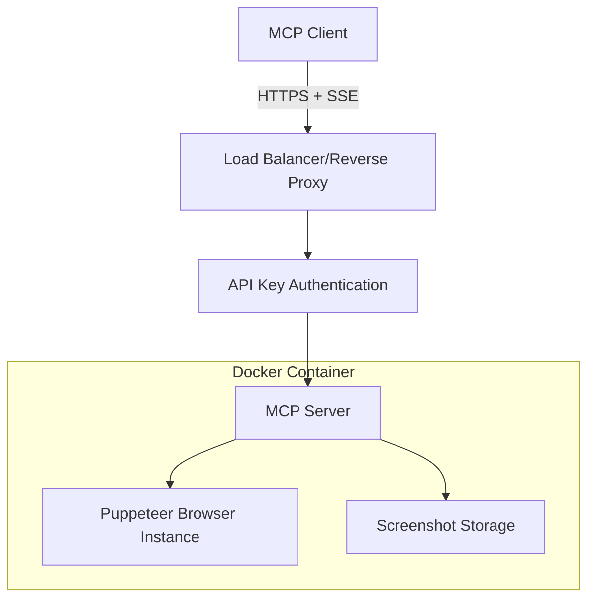

# Puppeteer MCP Server - Technical Specification

## Overview
This document outlines the technical specification for a self-hosted, remote Puppeteer MCP (Model Context Protocol) server with **multiple transport support**, API key authentication, and Docker deployment. The server now supports the modern MCP 2025-06-18 specification with Streamable HTTP transport alongside legacy SSE and stdio transports.

## Architecture

### System Architecture


### Technology Stack
- **Runtime**: Node.js 18+
- **Framework**: Express.js
- **Browser Automation**: Puppeteer
- **Transport**: Server-Sent Events (SSE)
- **Authentication**: Bearer Token (API Key)
- **Containerization**: Docker + Docker Compose
- **Language**: TypeScript

## MCP Protocol Implementation

### Transport Layer
The server supports **three transport mechanisms** for maximum compatibility:

#### 1. Streamable HTTP Transport (MCP 2025-06-18) - **Recommended**
- **Protocol**: HTTP with optional SSE streaming
- **Endpoints**:
  - `POST /http` - JSON-RPC message handling
  - `GET /http` - SSE stream establishment
  - `DELETE /http` - Session termination
- **Features**: Session management, resumability, event store
- **Authentication**: `Authorization: Bearer <api_key>`
- **Session Header**: `Mcp-Session-Id: <session_id>`

#### 2. Stdio Transport
- **Protocol**: HTTP-based stdio simulation
- **Endpoint**: `POST /stdio`
- **Features**: Stateless operation, simplified usage
- **Authentication**: `Authorization: Bearer <api_key>`
- **Content-Type**: `application/json`

#### 3. Legacy SSE Transport - **Backward Compatibility**
- **Protocol**: HTTP with Server-Sent Events (SSE)
- **Endpoints**:
  - `GET /sse` - SSE connection
  - `POST /messages` - Message sending
- **Authentication**: `Authorization: Bearer <api_key>`
- **Content-Type**: `text/event-stream`

### Message Format
```typescript
interface MCPMessage {
  jsonrpc: "2.0";
  id?: string | number;
  method?: string;
  params?: any;
  result?: any;
  error?: {
    code: number;
    message: string;
    data?: any;
  };
}
```

## Available Tools

The server implements 16 comprehensive Puppeteer tools including core browser automation, advanced mouse interactions, and authentication cookie management:

### 1. puppeteer_navigate
- **Purpose**: Navigate to a URL
- **Parameters**: 
  - `url` (string, required): URL to navigate to
  - `launchOptions` (object, optional): Puppeteer launch options
  - `allowDangerous` (boolean, optional): Allow dangerous launch options

### 2. puppeteer_screenshot
- **Purpose**: Take a screenshot of the current page or specific element
- **Parameters**:
  - `name` (string, required): Name for the screenshot
  - `selector` (string, optional): CSS selector for element screenshot
  - `width` (number, optional): Width in pixels (default: 800)
  - `height` (number, optional): Height in pixels (default: 600)
  - `encoded` (boolean, optional): Return base64-encoded data URI

### 3. puppeteer_click
- **Purpose**: Click an element on the page
- **Parameters**:
  - `selector` (string, required): CSS selector for element to click

### 4. puppeteer_fill
- **Purpose**: Fill out an input field
- **Parameters**:
  - `selector` (string, required): CSS selector for input field
  - `value` (string, required): Value to fill

### 5. puppeteer_select
- **Purpose**: Select an element on the page with Select tag
- **Parameters**:
  - `selector` (string, required): CSS selector for element to select
  - `value` (string, required): Value to select

### 6. puppeteer_hover
- **Purpose**: Hover over an element
- **Parameters**:
  - `selector` (string, required): CSS selector for element to hover

### 7. puppeteer_evaluate
- **Purpose**: Execute JavaScript in the browser console
- **Parameters**:
  - `script` (string, required): JavaScript code to execute

### 8. puppeteer_get_cookies
- **Purpose**: Retrieve cookies for authentication state analysis
- **Parameters**:
  - `urls` (array, optional): URLs to get cookies for
  - `names` (array, optional): Specific cookie names to retrieve
  - `domain` (string, optional): Filter cookies by domain

### 9. puppeteer_set_cookies
- **Purpose**: Set authentication cookies (session tokens, JWT, OAuth)
- **Parameters**:
  - `cookies` (array, required): Array of cookie objects with properties:
    - `name` (string, required): Cookie name
    - `value` (string, required): Cookie value
    - `domain` (string, optional): Cookie domain
    - `path` (string, optional): Cookie path
    - `secure` (boolean, optional): Secure flag
    - `httpOnly` (boolean, optional): HttpOnly flag
    - `sameSite` (string, optional): SameSite attribute
    - `expires` (number, optional): Expiration timestamp

### 10. puppeteer_delete_cookies
- **Purpose**: Delete cookies for logout and cleanup scenarios
- **Parameters**:
  - `cookies` (array, required): Array of cookie deletion requests:
    - `name` (string, required): Cookie name or "*" for all cookies
    - `domain` (string, optional): Cookie domain
    - `path` (string, optional): Cookie path
    - `url` (string, optional): URL for cookie context

## Security Features

### API Key Authentication
- **Method**: Bearer Token in Authorization header
- **Format**: `Authorization: Bearer <api_key>`
- **Validation**: Server validates API key against environment variable
- **Error Response**: 401 Unauthorized for invalid/missing keys

### Browser Security
- **Sandbox**: Puppeteer runs in sandboxed mode
- **Dangerous Args**: Filtered and controlled via allowDangerous flag
- **Resource Limits**: Memory and CPU limits via Docker

### Cookie Security
- **Authentication Focus**: Optimized for secure authentication cookie handling
- **Security Defaults**: Automatic secure defaults for auth cookies (HttpOnly, Secure, SameSite)
- **Validation**: Comprehensive cookie parameter validation and sanitization
- **XSS Prevention**: HttpOnly flag enforcement for authentication cookies
- **CSRF Protection**: SameSite attribute validation and recommendations
- **Domain Validation**: Strict domain validation to prevent cookie injection

## Environment Configuration

All configuration will be handled via environment variables:

```bash
# Server Configuration
PORT=3000
HOST=0.0.0.0
NODE_ENV=production

# Authentication
API_KEY=your-secure-api-key-here

# Puppeteer Configuration
PUPPETEER_SKIP_CHROMIUM_DOWNLOAD=true
PUPPETEER_EXECUTABLE_PATH=/usr/bin/chromium
PUPPETEER_LAUNCH_OPTIONS={}

# Docker Configuration
DOCKER_CONTAINER=puppeteer-mcp
```

## Docker Configuration

### Base Image
- **Base**: `node:18-bookworm-slim`
- **Browser**: Chromium (installed via apt)
- **Dependencies**: All required system libraries for Puppeteer

### Container Features
- **Non-root user**: Runs as dedicated user for security
- **Health checks**: HTTP endpoint for container health
- **Resource limits**: Configurable memory and CPU limits
- **Volume mounts**: Optional for persistent screenshot storage

## API Endpoints

### Streamable HTTP Transport Endpoints
```
# Initialize session and send messages
POST /http
Authorization: Bearer <api_key>
Content-Type: application/json
Mcp-Session-Id: <session_id> (after initialization)

# Establish SSE stream
GET /http
Authorization: Bearer <api_key>
Mcp-Session-Id: <session_id>
Accept: text/event-stream

# Terminate session
DELETE /http
Authorization: Bearer <api_key>
Mcp-Session-Id: <session_id>
```

### Stdio Transport Endpoint
```
POST /stdio
Authorization: Bearer <api_key>
Content-Type: application/json
```

### Legacy SSE Endpoints
```
# SSE connection
GET /sse
Authorization: Bearer <api_key>
Accept: text/event-stream

# Message sending
POST /messages?sessionId=<session_id>
Authorization: Bearer <api_key>
Content-Type: application/json
```

### Health Check
```
GET /health
Response: {"status": "ok", "timestamp": "2024-01-01T00:00:00Z"}
```

### Transport Statistics
```
GET /stats
Authorization: Bearer <api_key>
Response: {
  "serverInfo": {
    "supportedTransports": ["sse", "streamable_http", "stdio"]
  },
  "transports": {
    "activeTransports": 2,
    "activeSessions": 1
  }
}
```

### Transport Health Check
```
GET /health
Response: {
  "status": "healthy",
  "transports": {
    "sse": "available",
    "streamable_http": "available",
    "stdio": "available"
  }
}
```

## Error Handling

### Error Categories
1. **Authentication Errors** (401): Invalid/missing API key
2. **Validation Errors** (400): Invalid parameters
3. **Browser Errors** (500): Puppeteer/browser failures
4. **Network Errors** (503): Service unavailable

### Error Response Format
```json
{
  "jsonrpc": "2.0",
  "id": "request-id",
  "error": {
    "code": -32000,
    "message": "Browser error",
    "data": {
      "type": "PuppeteerError",
      "details": "Navigation timeout"
    }
  }
}
```

## Performance Considerations

### Browser Management
- **Single Instance**: One browser instance per container
- **Page Reuse**: Reuse pages when possible
- **Cleanup**: Automatic cleanup of unused pages
- **Timeouts**: Configurable timeouts for all operations

### Resource Limits
- **Memory**: 1GB default limit
- **CPU**: 1 core default limit
- **Concurrent Requests**: Limited to prevent resource exhaustion

## Deployment Architecture

### Docker Compose Setup
```yaml
version: '3.8'
services:
  puppeteer-mcp:
    build: .
    ports:
      - "3000:3000"
    environment:
      - API_KEY=${API_KEY}
      - PORT=3000
    deploy:
      resources:
        limits:
          memory: 1G
          cpus: '1.0'
    healthcheck:
      test: ["CMD", "curl", "-f", "http://localhost:3000/health"]
      interval: 30s
      timeout: 10s
      retries: 3
```

## Testing Strategy

### Unit Tests
- Tool parameter validation
- Authentication middleware
- Error handling

### Integration Tests
- Full MCP protocol flow
- Browser automation scenarios
- Docker container functionality

### Load Tests
- Concurrent request handling
- Resource usage under load
- Memory leak detection

## Monitoring and Logging

### Logging
- **Format**: Structured JSON logs
- **Levels**: ERROR, WARN, INFO, DEBUG
- **Output**: stdout (captured by Docker)

### Metrics
- Request count and duration
- Browser operation success/failure rates
- Memory and CPU usage
- Active connections

This specification provides the foundation for implementing a robust, secure, and scalable Puppeteer MCP server.